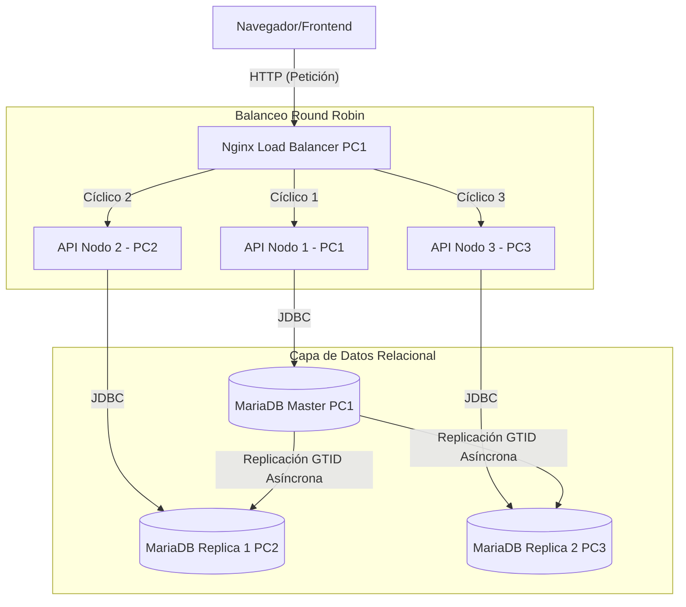

# Guía Técnica del Sistema Distribuido y Panel de Control

Esta guía detalla el diseño, la arquitectura y los conceptos del panel de control frontend y los servicios backend implementados para el laboratorio de **Replicación MariaDB y Transacciones ACID Distribuidas** en una red LAN (PC1, PC2 y PC3).

---

## 🖥️ Estructura del Panel de Control (Frontend)

El frontend está estructurado en tres secciones principales o pestañas, diseñadas para separar la operativa de usuario de la telemetría técnica e interna de los motores de bases de datos.

```
┌─────────────────────────────────────────────────────────────────────────┐
│                          BANCACID - PANEL CONTROL                       │
├───────────────┬───────────────────────────────┬─────────────────────────┤
│ 💸 Operaciones│ 🛠️ Detalles Técnicos (WAL/LSN) │ 🗄️ Replicación y JSON   │
└───────────────┴───────────────────────────────┴─────────────────────────┘
```

### 1. Pestaña 💸 Operaciones y Transacciones
Enfocada en simular el uso transaccional diario de un sistema financiero:
*   **Formulario de Transferencia Bancaria:** Permite realizar transferencias entre cuentas y ofrece la posibilidad de **Simular una Falla Repentina** (deteniendo la transacción justo antes del Commit para probar el mecanismo `UNDO`/Rollback).
*   **Tabla de Cuentas Bancarias:** Muestra en vivo los saldos de los clientes. Incluye el cálculo en tiempo real del **Invariante de Consistencia** (la suma total siempre debe dar `$165,000.00 USD`).
*   **Historial de Transacciones:** Registra cada intento de transferencia con su GUID, cuentas involucradas, monto, estado (ej. `COMPLETADA`, `REVERTIDA_FALLA`) y qué nodo del clúster balanceó la petición.

### 2. Pestaña 🛠️ Detalles Técnicos
Muestra la telemetría interna del sistema operativo y de la base de datos:
*   **Estado de Nodos LAN:** Lista los 3 nodos de la red, mostrando su dirección IP, rol (`Master`, `Replica 1`, `Replica 2`), si están activos o caídos y su latencia de respuesta.
*   **Monitor WAL e InnoDB Engine:** Muestra métricas críticas del motor interno InnoDB de MariaDB en el PC Master, tales como los números LSN en búfer y disco.
*   **Plantilla de Análisis de Fallos:** Botón interactivo que despliega una guía para auditorías manuales post-falla.
*   **Bitácora WAL de Aplicación:** Tabla cronológica que registra cada paso del algoritmo Write-Ahead Logging de la capa Java (ej. `INICIADA`, `WAL_GRABADO_BUFFER`, `REDO_PREPARADO`, `COMMIT_FLUSH`, `ROLLBACK_EJECUTADO`).

### 3. Pestaña 🗄️ Bases de Datos y Replicación
Dedicada exclusivamente a inspeccionar el estado de la topología distribuida:
*   **Tabla de Topología MariaDB GTID:** Muestra la configuración de replicación de cada nodo (Server ID, posición GTID actual, host master conectado, modo lectura/escritura).
*   **Verificación de Lectura Distribuida:** Realiza consultas JDBC directas e independientes a la base de datos de cada PC para comparar cuántas cuentas y qué suma de saldo reporta cada nodo en tiempo real, garantizando la consistencia eventual o estricta.
*   **Consola en Vivo de Lectura Bruta (JSON):** Herramienta que permite consultar directamente las tablas `cuentas`, `transacciones` y `bitacora_wal` de cualquier base de datos (PC1, PC2 o PC3) mediante un botón y visualizar el resultado en formato JSON estructurado en un visor claro.

---

## 📚 Glosario de Conceptos y Abreviaciones

### ACID (Propiedades de las Transacciones)
Conjunto de características que garantizan la confiabilidad de las transacciones en una base de datos:
*   **A - Atomicidad (Atomicity):** O se ejecutan todas las operaciones de una transacción o no se ejecuta ninguna. Si ocurre un fallo a mitad de una transferencia (ej. se descuenta de la cuenta de origen pero falla antes de abonar al destino), el sistema realiza un **Rollback** (`UNDO`) para volver al estado inicial.
*   **C - Consistencia (Consistency):** Una transacción solo puede llevar a la base de datos de un estado válido a otro. En este sistema, la consistencia se valida mediante el **Invariante de Consistencia** ($165,000 USD totales).
*   **I - Aislamiento (Isolation):** Determina cómo y cuándo los cambios realizados por una operación se hacen visibles para otras. Los niveles implementados son:
    *   `READ COMMITTED`: Una transacción solo puede leer datos que ya han sido confirmados. Evita lecturas sucias.
    *   `REPEATABLE READ`: Garantiza que cualquier dato leído durante la transacción permanecerá idéntico en lecturas posteriores dentro de la misma transacción.
    *   `SERIALIZABLE`: El nivel más estricto. Bloquea las filas involucradas para que ninguna otra transacción las lea o modifique, previniendo lecturas fantasmas.
*   **D - Durabilidad (Durability):** Una vez que una transacción ha sido confirmada (`Commit`), sus efectos persistirán en el almacenamiento secundario (disco), incluso ante un apagón o fallo de energía. Esto se logra mediante la bitácora WAL.

### WAL (Write-Ahead Logging)
*   **Concepto:** Técnica que establece que los cambios en una base de datos deben ser escritos en un registro o bitácora en disco (*log file*) **antes** de que se apliquen realmente a las tablas físicas.
*   **Mecanismo de Recuperación:**
    *   **REDO:** Si ocurre un fallo del sistema y el commit fue registrado en el log pero los datos no llegaron al disco, el sistema lee el log y "vuelve a aplicar" los cambios al reiniciar.
    *   **UNDO:** Si ocurre una falla antes de confirmar el commit, el log permite rastrear las operaciones incompletas y deshacerlas (Rollback) para evitar estados corruptos.

### LSN (Log Sequence Number)
Número de secuencia único y monótonamente creciente asignado a cada registro en el archivo de log del motor InnoDB:
*   **LSN Master (Búfer):** Posición del último cambio realizado en la memoria RAM del servidor.
*   **LSN Flushed (Disco):** Posición del último registro que ha sido descargado y sincronizado físicamente a los archivos de disco.
*   **LSN Checkpoint:** El punto más antiguo del archivo de log donde los datos modificados ya han sido escritos de manera segura y definitiva en el almacenamiento físico de la base de datos. Sirve como punto de inicio para la recuperación en caso de fallo.

### GTID (Global Transaction Identifier)
Identificador único global que se asigna a cada transacción confirmada en un servidor MariaDB Master:
*   **Estructura:** Típicamente tiene el formato `domain_id-server_id-sequence_number` (ej. `0-1-124`).
*   **Propósito:** Facilita el seguimiento de la replicación sin depender de coordenadas físicas de archivos de log binarios. Si una réplica se desconecta y vuelve a conectarse, simplemente le dice al Master cuál es su posición GTID actual y este le envía únicamente las transacciones faltantes.

### Replicación Master-Replica
*   **Master (PC1):** Nodo primario y el único configurado para recibir transacciones de escritura (`@@read_only = 0`). Las transferencias bancarias se ejecutan aquí.
*   **Replicas (PC2 y PC3):** Nodos secundarios configurados en modo de solo lectura (`@@read_only = 1`). Se sincronizan de forma asíncrona leyendo el registro binario del Master.
*   **Consistencia Eventual:** Existe un retraso milimétrico (*replication lag*) en la red LAN para que las escrituras del PC1 impacten en PC2 y PC3. El panel del frontend permite inspeccionar esta latencia.

### Round Robin (Balanceador de Carga)
Algoritmo de planificación utilizado por el servidor proxy Nginx en PC1 para distribuir las peticiones web HTTP entrantes de manera cíclica y equitativa entre los tres nodos del backend API en la LAN (API 1 &rarr; API 2 &rarr; API 3 &rarr; API 1...), optimizando el uso de recursos y evitando sobrecargar un solo nodo.

### JDBC (Java Database Connectivity)
API estándar de Java que permite a las aplicaciones conectarse a motores de bases de datos relacionales, ejecutar sentencias SQL y procesar los resultados. En este laboratorio, la API utiliza JDBC para conectarse de forma paralela e independiente a los contenedores MariaDB locales en PC1, PC2 y PC3.

---

## 📊 Arquitectura de Datos del Sistema

El flujo de peticiones y replicación se representa de la siguiente manera:



Esta arquitectura garantiza que las operaciones críticas (escrituras) siempre se deriven o direccionen al Master, mientras que la lectura distribuida y auditoría del frontend pueda validar la sincronía de las réplicas en tiempo real.
