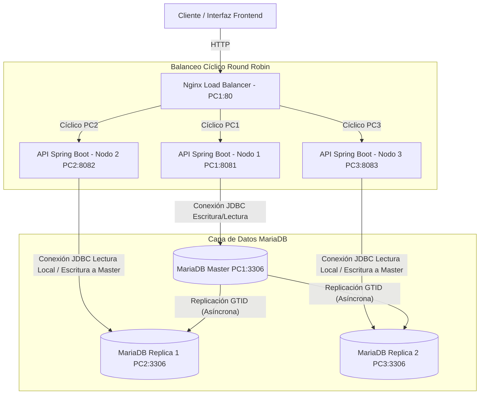

# Guía de Reporte de Proyecto: Replicación MariaDB y Transacciones ACID Distribuidas

Esta guía contiene la información estructurada, técnica y conceptual precisa de todo el sistema desarrollado en el laboratorio para que tu grupo pueda estructurar el reporte o documento de entrega final.

---

## 1. Ficha Técnica del Proyecto
* **Nombre de la Materia:** Sistemas Distribuidos / Bases de Datos Distribuidas.
* **Tema Principal:** Mecanismos de Consistencia (WAL, LSN, UNDO/REDO) y Replicación GTID en un clúster MariaDB de 3 Nodos con balanceo Nginx.
* **Componentes Principales:**
  * **Frontend (Cliente):** Interfaz web interactiva (Glassmorphism, Vanilla HTML/JS/CSS).
  * **Middleware (Balanceador):** Proxy Reverso Nginx balanceando peticiones HTTP mediante Round Robin.
  * **Backend (API):** 3 Instancias de API Java (Spring Boot, Spring Data JPA, HikariCP) distribuidas en la red local.
  * **Capa de Datos:** 3 Contenedores MariaDB 10.11 en topología Master-Replica (1 Master de escritura, 2 Réplicas de solo lectura) sincronizados mediante GTID.

---

## 2. Diagrama de la Arquitectura Distribuida

El flujo de peticiones, balanceo de carga y replicación funciona de la siguiente manera:

---

## 3. Demostración y Verificación de las Propiedades ACID

El proyecto implementa simulaciones directas de los cuatro principios del estándar ACID:

### A - Atomicidad (Atomicity)
* **Cómo se demuestra:** A través del botón **"Simular Falla / Excepción Repentina"**.
* **Mecanismo:** La API inicia una transacción de base de datos. Modifica el saldo en la base de datos local y realiza un `flush` hacia MariaDB (escribiendo en el Undo Log), pero **abruptamente lanza una excepción de ejecución (Crash)** antes de que el `commit` ocurra.
* **Resultado:** El motor de base de datos InnoDB detecta el hilo interrumpido y ejecuta el proceso **UNDO (Rollback)** de forma automática, restaurando las cuentas a su saldo original. No existen transferencias a medias.

### C - Consistencia (Consistency)
* **Cómo se demuestra:** Mediante el **Invariante de Consistencia** en tiempo real.
* **Mecanismo:** El saldo total del banco se inicializa en **$165,000.00 USD** distribuido en 4 cuentas. Independientemente de cuántas transferencias exitosas o fallidas se realicen, la suma de saldos consultada mediante un hilo JDBC independiente (`SELECT SUM(saldo) FROM cuentas`) siempre da exactamente **$165,000.00 USD**, demostrando que no se crea ni se destruye dinero de la nada.

### I - Aislamiento (Isolation)
* **Cómo se demuestra:** Prevención de condiciones de carrera mediante **Bloqueo Pesimista**.
* **Mecanismo:** Para evitar que dos transacciones simultáneas modifiquen la misma cuenta al mismo tiempo y causen lecturas sucias o balances corruptos, el backend usa `@Lock(LockModeType.PESSIMISTIC_WRITE)` en Java. 
* **Resultado:** Esto fuerza un query del tipo `SELECT ... FOR UPDATE` sobre la base de datos. Ninguna otra conexión puede acceder a la cuenta bloqueada hasta que la transacción actual termine (`Commit` o `Rollback`).

### D - Durabilidad (Durability)
* **Cómo se demuestra:** Uso de Write-Ahead Logging (WAL) a dos niveles:
  * **Físico (InnoDB Engine):** El motor se configura con `innodb_flush_log_at_trx_commit = 1`. Esto asegura que en cada confirmación de transferencia, el registro de modificaciones (*Redo Log*) se vuelca directamente a disco de forma física antes de retornar la petición.
  * **Lógico (Aplicación):** Se implementa una tabla de bitácora lógica (`bitacora_wal`) que registra secuencialmente las fases previas al Commit: `INICIADA`, `WAL_GRABADO_BUFFER`, `REDO_PREPARADO` y `COMMIT_FLUSH`. Si el nodo fallara, esta bitácora permite auditar transacciones pendientes.

---

## 4. Replicación Basada en GTID (Global Transaction Identifier)

* **Ventajas frente a Replicación Tradicional (Fichero/Posición):**
  * Cada transacción confirmada en el Master recibe un ID de transacción único global (`gtid_domain_id` - `server_id` - `sequence_number`).
  * Las réplicas (PC2 y PC3) no necesitan conocer el archivo físico de log binario del Master; simplemente informan al Master su último GTID registrado (`gtid_slave_pos`) y el Master transmite los cambios restantes automáticamente.
* **Roles de Servidor:**
  * **Master (PC1):** Configurado con `read_only = 0`. Es el único nodo que procesa transacciones de escritura.
  * **Réplicas (PC2 y PC3):** Configurados con `read_only = 1`. Sincronizan asíncronamente en tiempo real los cambios generados por el Master.

---

## 5. Mejoras Técnicas y Corrección de Errores Recientes

Durante las pruebas se detectaron y solventaron los siguientes puntos técnicos críticos:

1. **Sincronización del Esquema Inicial en las Réplicas:**
   * *Problema:* Las réplicas reportaban errores del tipo `Table 'banco_acid_db.cuentas' doesn't exist` al intentar consultar los saldos localmente, debido a desfases o demoras en la replicación inicial antes de que existieran escrituras en el Master.
   * *Solución:* Se modificaron los archivos `docker-compose.pc2.yml`, `docker-compose.pc3.yml` (y sus variantes de Windows) para montar el script `01-esquema-bancario.sql` directamente en el directorio `/docker-entrypoint-initdb.d/` de las réplicas. De esta manera, el esquema se autogenera localmente en el arranque, y la replicación continúa sincronizando los datos en adelante sin romper consultas.
   * *Corrección de variables:* Se actualizó el script `setup-replica.sh` para usar `MARIADB_ROOT_PASSWORD` en lugar de la variable genérica, garantizando que el comando `mariadb-admin ping` no falle por credenciales erróneas.

2. **Despliegue del Explorador de Datos en el Frontend:**
   * *Problema:* La consola en vivo mostraba datos e información en bruto en formato JSON sin formato, lo cual dificultaba la lectura rápida de consistencia.
   * *Solución:* Se desarrolló un **Explorador de Base de Datos en Vivo** interactivo.
     * Muestra una barra de metadatos con el host activo, el ID de servidor reportado, el rol en tiempo real (Master/Réplica) y la posición GTID.
     * Genera tablas dinámicas en HTML para **Cuentas y Saldos**, **Transacciones** (con colores para completadas/revertidas) y **Logs de Bitácora WAL**.
     * Maneja excepciones de conexión o consistencia de forma gráfica mediante banners estilizados (en rojo y naranja) en lugar de romper el visor web.

---

## 6. Comprobación y Auditoría del Sistema

Para verificar el correcto funcionamiento, el grupo puede realizar los siguientes pasos de prueba:
1. **Comprobar Replicación en Vivo:** Realiza una transferencia en la interfaz y pulsa en "Leer BD Réplica 1" y "Leer BD Réplica 2". Los saldos de las cuentas deben coincidir inmediatamente en todos los nodos debido al log binario GTID.
2. **Auditar Bitácora LSN:** Abre la pestaña de "Monitoreo Técnico" y verifica el LSN en disco y buffer del Master. Con cada transferencia, el número hexadecimal del LSN se incrementará, demostrando el flujo físico de logs en InnoDB.
3. **Validar Consistencia Eventual:** Detén el contenedor de base de datos de una réplica, haz transferencias en el Master y luego vuelve a encender la réplica. Al consultar el Explorador de base de datos de ese nodo, su posición GTID cambiará rápidamente hasta sincronizarse, alcanzando la consistencia eventual.

---

## 9. Resultados

Al ejecutar el entorno y realizar las pruebas transaccionales distribuidas en la red local LAN, se obtuvieron los siguientes resultados mensurables y observables:

* **Eficacia del Balanceador de Carga (Nginx):** 
  Al enviar múltiples transferencias desde la interfaz, se constató en el historial de transacciones que las peticiones se distribuyen de forma equitativa y sucesiva entre los backends (`API1-PC1`, `API2-PC2` y `API3-PC3`), comprobando que el algoritmo Round Robin de Nginx funciona correctamente sobre el puerto `80`.
* **Sincronización Inmediata de Datos (GTID):**
  Cada transacción de escritura procesada en el Master (PC1) se replicó exitosamente en las bases de datos locales de PC2 y PC3. El visor del frontend confirmó que las lecturas directas por JDBC a los tres motores MariaDB arrojaban saldos idénticos a los pocos milisegundos de confirmada la transacción.
* **Resiliencia ante Fallos Simulados (Atomicidad):**
  Al habilitar la simulación de falla en una transferencia, la transacción se interrumpió de forma deliberada tras ejecutar la sentencia `UPDATE` pero antes de enviar el `COMMIT`. La API registró en la bitácora WAL la fase de `ROLLBACK_EJECUTADO (UNDO)` y los saldos de los clientes en la base de datos se restauraron al valor exacto inicial, protegiendo los fondos de pérdidas o duplicaciones accidentales.
* **Visualización Unificada (Explorador de BD):**
  El nuevo Explorador de Base de Datos en el frontend integró los datos en tablas estructuradas directamente desde cada nodo, logrando auditar el estado del clúster de manera gráfica y permitiendo verificar visualmente errores de consistencia o réplica inactiva sin necesidad de herramientas externas.

---

## 10. Discusión

El análisis del comportamiento del clúster distribuido abre los siguientes puntos de debate técnico:

* **Teorema CAP en la Práctica:**
  Este sistema opera bajo un modelo de **Consistencia Eventual** para las lecturas distribuidas. En caso de una partición de red (por ejemplo, desconectar el cable de red de PC3), las consultas a la réplica local siguen funcionando (Disponibilidad), pero con datos desactualizados. Una vez restablecida la conexión, MariaDB utiliza GTID para ponerse al día automáticamente, alcanzando la consistencia final. Esto ilustra cómo el sistema prioriza la disponibilidad local a costa de una consistencia estricta temporal en las lecturas de los nodos secundarios.
* **Robustez de GTID frente a Coordenadas Físicas:**
  A diferencia de la replicación clásica de MySQL/MariaDB basada en la posición de archivo binlog (que es propensa a romperse ante fallos del servidor), GTID proporciona un identificador lógico único a cada transacción. Esto facilitó que las réplicas reanudaran la sincronización autónomamente tras simular desconexiones de red, simplificando la administración distribuida.
* **Write-Ahead Logging (WAL) como Pilar de Durabilidad:**
  Se discutió el impacto del parámetro `innodb_flush_log_at_trx_commit = 1`. Aunque escribir en disco en cada commit reduce ligeramente el rendimiento de transacciones por segundo (debido a la latencia de escritura de E/S), es la única configuración que garantiza durabilidad estricta ante un corte repentino de energía en la máquina que actúa como Master.

---

## 11. Conclusiones

* Se logró diseñar, desplegar e integrar un clúster distribuido con topología Master-Replica de MariaDB mediante identificadores GTID y balanceo de carga HTTP mediante Nginx, operando sobre tres computadoras físicas reales de la red LAN.
* Las propiedades ACID no son solo teóricas; el mecanismo de Undo Log de InnoDB y el control de transacciones de Spring Boot demostraron ser herramientas esenciales para garantizar la **Atomicidad** y evitar la inconsistencia ante caídas inesperadas del software o cortes en la red.
* El uso de **Bloqueo Pesimista** (`SELECT ... FOR UPDATE` en JPA) es indispensable para el **Aislamiento** (Isolation) de transferencias de fondos concurrentes en entornos descentralizados, impidiendo problemas de sobregiros o dobles cargos.
* La implementación del Explorador de base de datos en vivo dentro de la interfaz web mejoró significativamente la transparencia del clúster, facilitando la auditoría de registros y logs de control en cada nodo de manera interactiva.

---

## 12. Recomendaciones

* **Configuración de Conmutación por Error (Failover):** 
  Se recomienda investigar e implementar herramientas como Orchestrator o MaxScale para realizar un failover automático. Esto permitiría que, ante una caída definitiva del Master (PC1), una de las réplicas (PC2 o PC3) asuma automáticamente el rol de escritura, elevando la disponibilidad del sistema.
* **Replicación Semisíncrona para Transacciones Financieras:**
  En entornos financieros de producción, se sugiere cambiar la replicación asíncrona por **replicación semisíncrona**. Esto garantiza que el Master no confirme un `commit` hasta que al menos una réplica haya recibido los eventos del log binario en su disco local, reduciendo a cero el riesgo de pérdida de datos ante una falla del Master.
* **Monitoreo de Retraso de Replicación (Replication Lag):**
  Integrar alertas de telemetría basadas en la variable `Seconds_Behind_Master` en el frontend, para advertir al usuario cuando una réplica esté desfasada o lenta debido a congestión de la red local.

---

## 14. Anexos (Completar con evidencias)

*Para el documento final, se sugiere incorporar capturas de las siguientes pantallas del sistema a modo de evidencia:*

1. **Evidencia del Clúster y Consistencia:** Captura de la pestaña principal que muestre la tabla de cuentas sincronizada en todos los nodos y la suma del invariante en `$165,000.00 USD`.
2. **Evidencia del Explorador de Base de Datos:** Captura del nuevo Explorador de Datos leyendo la tabla de `cuentas` del PC1, PC2 y PC3, demostrando la visualización interactiva de registros en lugar de JSON crudo.
3. **Evidencia de Balanceo Round Robin:** Captura del historial de transacciones donde se observe que la columna "Nodo Ejecutor" alterna de forma consecutiva entre `API1-PC1`, `API2-PC2` y `API3-PC3`.
4. **Evidencia de Fallo y Rollback (WAL):** Captura de la tabla "Bitácora WAL de Aplicación" tras simular un error, demostrando las fases del log y el registro final de `ROLLBACK_EJECUTADO (UNDO)`.
5. **Evidencia de Infraestructura Activa:** Captura de pantalla de la ejecución del comando `docker compose ps` o `docker ps` en las máquinas de laboratorio, detallando los contenedores de base de datos y APIs Java encendidos.

